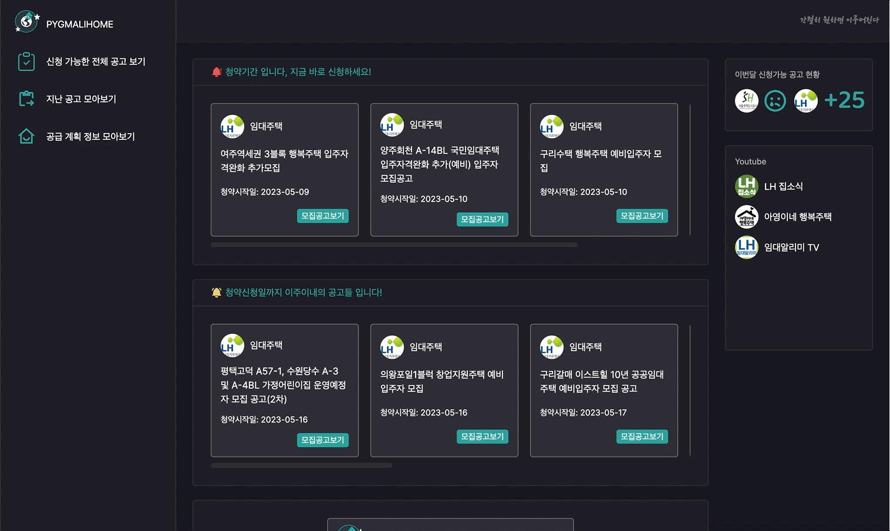

# PYGMALIHOME

LH와 SH 공고의 청약 기간을 일상 생활로 인해 놓치는 경우가 많아, 이를 방지하고 두 기관의 정보를 필요한 내용만 골라 한 사이트에서 한 번에 확인할 수 있도록 만든 서비스 입니다.

## Features

- 청약신청일 기준으로 기간당일, 이주이내, 한달이내로 공고를 분리해서 정보 제공
- 이메일 구독을 통해 청약신청일 알림 서비스 제공

## Tech Stack

**Client:** Typescript, Next.js, Emotion, TanstackQuery, Axios

**Server:** NestJS, Supabase, Typeorm, Github Actions, Vercel

## Installation

yarn을 사용하여 설치할 경우는 아래와 같습니다.

```bash
  cd pygmalihome
  yarn install --frozen-lockfile
```

## Run Locally

Clone the project

```bash
  git clone https://link-to-project
```

Go to the project directory

```bash
  cd pygmalhome
```

Install dependencies

```bash
  yarn install
```

Start the server

```bash
  yarn run dev
```

## Demo



## Related

- [lh](https://apply.lh.or.kr/LH/index.html?Sls#MN::CLCC_MN_0010:)
- [sh](https://www.i-sh.co.kr/app/index.do)
- [openapi](https://www.data.go.kr/index.do)

[Awesome README](https://github.com/matiassingers/awesome-readme)

## Roadmap

- 관련 정보를 제공하는 유튜브의 유트브 업데이트 내역 정보 제공 추가

- 공급 계획 정보 제공 기능 추가

## Authors

- [@quessr](https://www.github.com/quessr)
